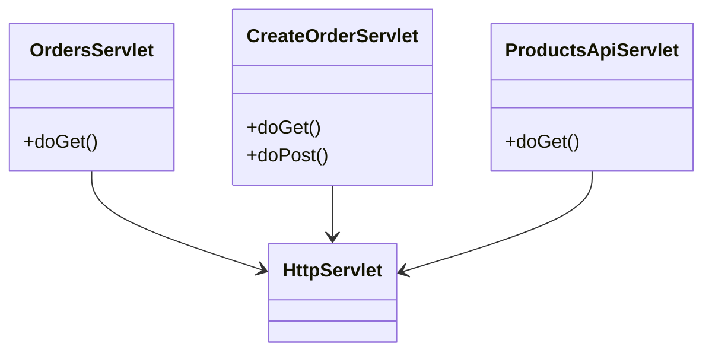

# Лабораторная работа — Веб-приложение на сервлетах

## 📌 Описание

Веб-приложение для управления заказами и получения информации о продуктах. Реализовано с использованием сервлетов и деплоится на сервер Apache Tomcat 11 в формате WAR.

## 🚀 Основные возможности

- Список заказов: `/orders`
- Форма создания заказа: `/create-order`
- REST API для получения информации о продуктах: `/api/products`

## ⚙️ Сборка и деплой

```bash
./gradlew war
```

Скопировать `build/libs/app.war` в папку `webapps` Tomcat 11.

## 🧪 Тестирование

REST-сервис доступен по адресу:
```
GET http://localhost:8080/app/api/products
```

## 📋 UML-диаграмма классов (Mermaid)



## 🔗 Дополнительно

Инструкция по установке и настройке Tomcat — см. `README_TOMCAT.md`